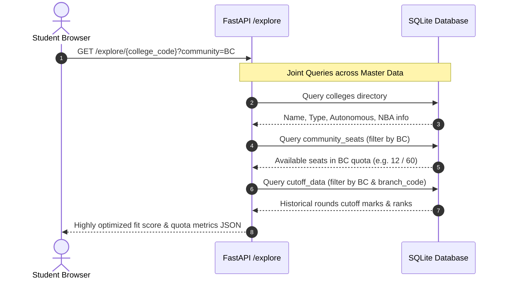
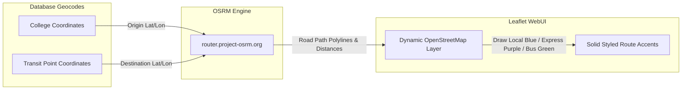

# Counsly Data Flow Architecture & Lifecycle
**Project Scope:** TNEA 2027 Data-Only MVP  
**Tech Stack:** Next.js 14 (App Router) + FastAPI + SQLite

---

## 1. High-Level Data Flow Overview

Counsly operates as an offline-first, high-performance data-only MVP. The data architecture flows seamlessly across three primary tiers: client browser (`sessionStorage` and local React contexts), FastAPI advisory router layers, and SQLite structured master/workspace databases.

```mermaid
graph TD
    subgraph Client Browser (Next.js 14)
        UI[Student UI AppShell]
        LocalCtx[React AppContext]
        SStorage[sessionStorage Session Cache]
    end

    subgraph Advisory API Tier (FastAPI)
        AuthRoute[Auth & Profile Router]
        ExploreRoute[Explore & Search Router]
        ChoiceRoute[Choice List Router]
        MapsRoute[GIS Maps Router]
    end

    subgraph Relational Storage (SQLite)
        MasterDB[(Master Data: Colleges & Cutoffs)]
        WorkDB[(Workspace Data: Users & Preferences)]
    end

    UI -->|1. Onboard / Authenticate| AuthRoute
    UI -->|2. Search & Filter Quotas| ExploreRoute
    UI -->|3. File Priorities| ChoiceRoute
    UI -->|4. Request Road Directions| MapsRoute

    AuthRoute <-->|Read / Write Profile| WorkDB
    ExploreRoute <-->|Query Master Data| MasterDB
    ChoiceRoute <-->|Save Choice List| WorkDB
    MapsRoute <-->|Query Geocodes| MasterDB

    LocalCtx <--> SStorage
    UI <--> LocalCtx
```

---

## 2. Dynamic Data Lifecycle Phases

### Phase A: Onboarding, Cutoff Calculation & Workspace Sync
1. **Input Collection:** The student enters their subject marks (Mathematics, Physics, Chemistry), Date of Birth, community quota category (OC, BC, BCM, MBC, SC, SCA, ST), and preferred branch targets in the profile editor or onboarding wizard.
2. **Client-Side Cutoff Computation:** Cutoff marks are computed instantly on the frontend:
   $$\text{TNEA Cutoff} = \text{Mathematics} + \frac{\text{Physics}}{2} + \frac{\text{Chemistry}}{2}$$
3. **Eligibility Gateway:** If the cutoff is $\ge 78.0$, the student passes TNEA qualifying thresholds.
4. **Database State Persistence:** The frontend posts the completed profile to `/auth/onboarding` or `/auth/profile`. The backend saves:
   - User credentials to `users`.
   - Workspace profile and completed state to `workspaces`.
   - District filter and branch priorities list to `workspace_settings` (stored as stringified arrays/JSON configurations).

---

### Phase B: College Explorer, Community Seats & Cutoff History
When a student browses colleges on the explorer page or views recommendations, the data flows dynamically based on their community quota context:



---

### Phase C: Choice List Filing & Priority Reordering
1. **Filing Choices:** When a student selects a branch in a college to add to their choices, a `POST` request is dispatched to `/choices/add`.
2. **Constraint Verification:** The backend confirms that:
   - The branch and college exist in `college_branches`.
   - The priority ranking does not exceed limits (1 to 300).
3. **Database Write:** Stored securely inside `user_college_preferences` mapped against the user's active `workspace_id`.
4. **Filing Snapshots:** Students can capture their current preference ranks as a static snapshot, executing a transactional duplicate copy from `user_college_preferences` to `shortlist_snapshots` and `shortlist_snapshot_items`.

---

### Phase D: GIS Map & Transit Routing Pipeline
Counsly's map inspector resolves accurate road driving distances to 4 verified transit categories: local commuter halt, express rail junction, regional bus stand, and local bus stop.



---

## 3. SQLite Database Schema Mappings

The following tables handle the backend state:

```text
  +--------------------+             +------------------+             +----------------------+
  |       users        |             |    workspaces    |             |  workspace_settings  |
  +--------------------+             +------------------+             +----------------------+
  | id (PK)            | <---------- | id (PK)          | <---------- | id (PK)              |
  | auth_user_id (UQ)  |             | user_id (FK)     |             | workspace_id (FK)    |
  | google_email       |             | name             |             | default_district     |
  | name               |             | onboarding_step  |             | preferred_branches   |
  | roll_number        |             +------------------+             +----------------------+
  +--------------------+                      |
                                              |
                                              v
                              +----------------------------+
                              |  user_college_preferences  |
                              +----------------------------+
                              | id (PK)                    |
                              | workspace_id (FK)          |
                              | college_code               |
                              | branch_code                |
                              | priority                   |
                              +----------------------------+
```

### Table Dictionary Summary
* **Master Directories (Static Read-Only):**
  - `colleges`: Core directory of Tamil Nadu colleges, geolocations, and parameters.
  - `branches`: Comprehensive course catalogue.
  - `college_branches`: Valid college and branch intake configurations.
  - `cutoff_data`: Aggregated historical cutoffs.
  - `community_seats`: Multi-community seats availability matrix.
  - `tfc_locations`: Address and coordinates of TNEA Facilitation Centres.
* **Workspace Engine (Dynamic Read-Write):**
  - `users` / `workspaces`: Authenticated sessions and completion milestones.
  - `workspace_settings`: Filter criteria defaults.
  - `user_college_preferences`: Live priorities filed by the student.
  - `shortlist_snapshots` / `shortlist_snapshot_items`: Archived preference configurations.
  - `device_fingerprints`: Anti-abuse rate-limiting layer.
  - `workspace_activity`: Append-only student audit ledger.
