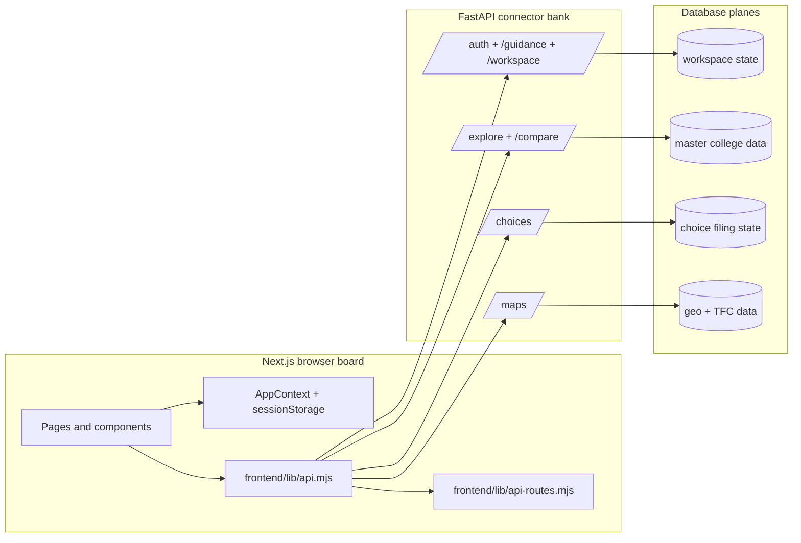

# Counsly PCB Data Flow

**Goal:** make the product feel like a printed circuit board, not a bundle of loose jumper wires. Every feature should connect through a named lane, a stable connector, and one data contract.

---

## 1. Board Layout

Counsly has four lanes. A change should usually fit into exactly one lane, and cross-lane traffic should happen only through the API connector listed here.

| PCB lane | Frontend surface | API connector | Storage plane | Rule |
| --- | --- | --- | --- | --- |
| Identity lane | Login, onboarding, profile | `/auth/*`, `/guidance/onboarding`, `/workspace/settings` | `users`, `workspaces`, `workspace_settings`, `device_fingerprints` | Owns who the student is and their saved context. |
| Discovery lane | Explore, recommendations, compare | `/explore/*`, `/compare/*` | `colleges`, `branches`, `college_branches`, `cutoff_data`, `community_seats` | Read-only master-data queries; never mutates choices. |
| Filing lane | Choices, snapshots, CSV import | `/choices/*` | `user_college_preferences`, `shortlist_snapshots`, `shortlist_snapshot_items` | Owns the student's ordered filing list. |
| Location lane | Maps, TFC centers, transit hubs | `/maps/*` | `colleges`, `tfc_locations` | Owns coordinates and route-friendly transit payloads. |



---

## 2. Connector Manifest

The frontend must not scatter stringly typed endpoints through page components. Endpoint names live in `frontend/lib/api-routes.mjs`; request/response normalization lives in `frontend/lib/api.mjs`; pages call feature helpers only.

```text
Page/component
  -> feature helper in frontend/lib/api.mjs
    -> endpoint from frontend/lib/api-routes.mjs
      -> backend route module
        -> SQLAlchemy model / database table
```

This gives each route a solder pad. If a URL changes, the trace is repaired in one place instead of hunting through the whole board.

---

## 3. Lane Contracts

### Identity lane

1. `startSession()` opens or resumes a user session.
2. `runOnboarding()` computes eligibility and stores onboarding context.
3. `fetchWorkspaceSettings()` and `updateWorkspaceSettings()` keep UI preferences synced.
4. `verifyRollNumber()` is an identity-side check; discovery pages should not duplicate it.

### Discovery lane

1. `searchColleges()` sends normalized community context with the search payload.
2. `fetchCollegeDetail()` reads one college detail payload for one selected community.
3. `compareColleges()` compares selected colleges and branches without mutating saved choices.
4. Recommendations should consume discovery payloads, not reimplement cutoff joins in the UI.

### Filing lane

1. `fetchChoices()` reads the current ordered filing list.
2. `addChoice()`, `updateChoice()`, and `reorderChoices()` are the only frontend write connectors for live choices.
3. Snapshot helpers own archival copy/restore behavior.
4. CSV upload enters through `uploadChoiceCsv()` so validation stays behind one API port.

### Location lane

1. `fetchMapColleges()` returns map-ready college and transit-point records.
2. `fetchTfcLocations()` returns facilitation centers.
3. Route drawing and external navigation URL construction stay in map-specific helpers; discovery payloads should not grow map-only display state.

---

## 4. Anti-Spaghetti Rules

1. **No page-to-backend string wiring:** pages should call helpers from `frontend/lib/api.mjs`, not raw `fetch("/some/path")` calls.
2. **No duplicate endpoint literals:** shared endpoint paths belong in `frontend/lib/api-routes.mjs`.
3. **No cross-lane writes:** discovery and location reads must not mutate filing state.
4. **No UI-owned database joins:** backend route modules own joins, filtering, pagination bounds, and write validation.
5. **No hidden generated state:** generated data and extraction outputs should be documented as data pipeline artifacts, not mixed into runtime app flow.

---

## 5. Change Checklist

Before adding a feature, pick the PCB lane and answer these questions:

- Which lane owns the feature?
- Which helper in `frontend/lib/api.mjs` is the public connector?
- Does `frontend/lib/api-routes.mjs` already have the endpoint solder pad?
- Which backend route module owns validation?
- Which database plane is read or written?
- Which unit/integration test proves the trace still conducts?
